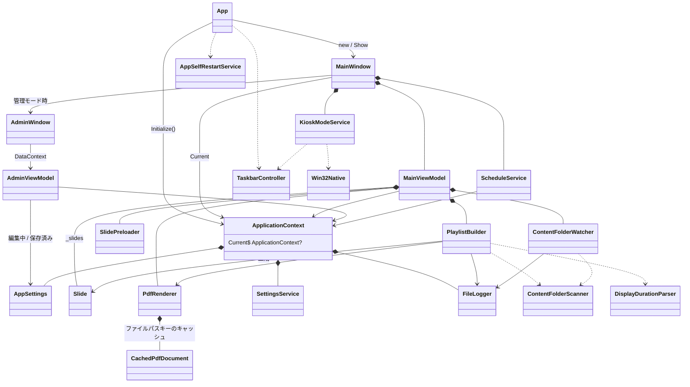
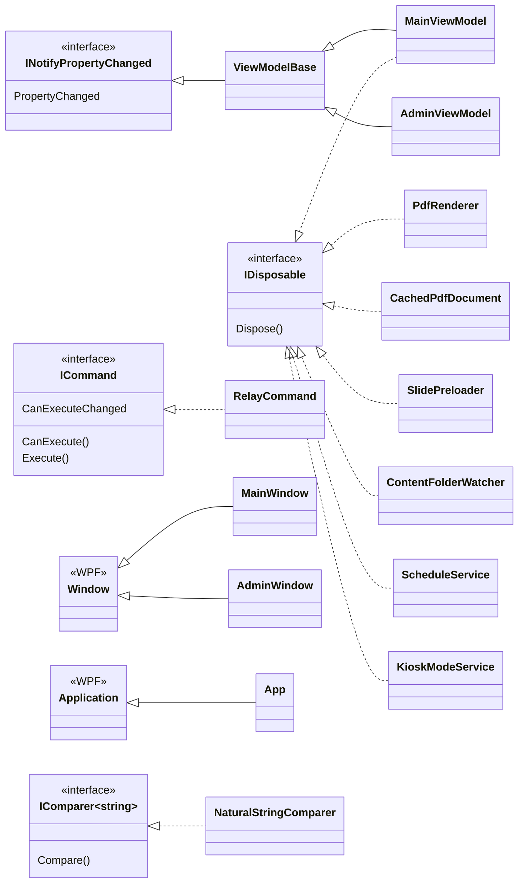
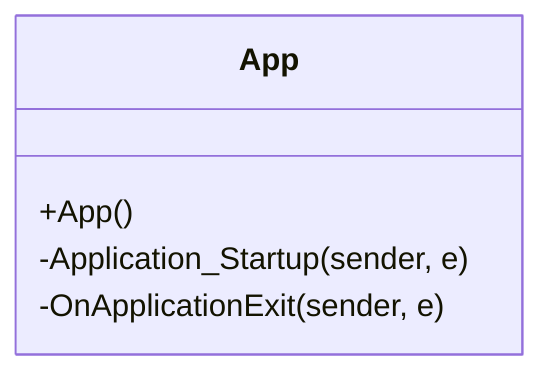
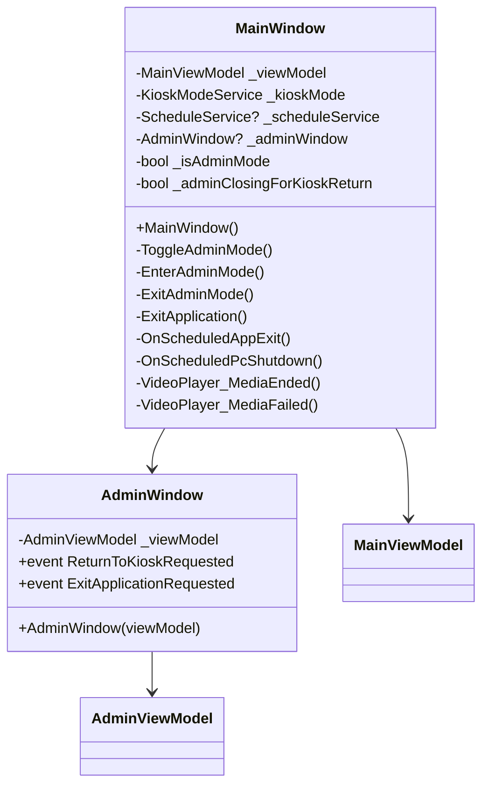
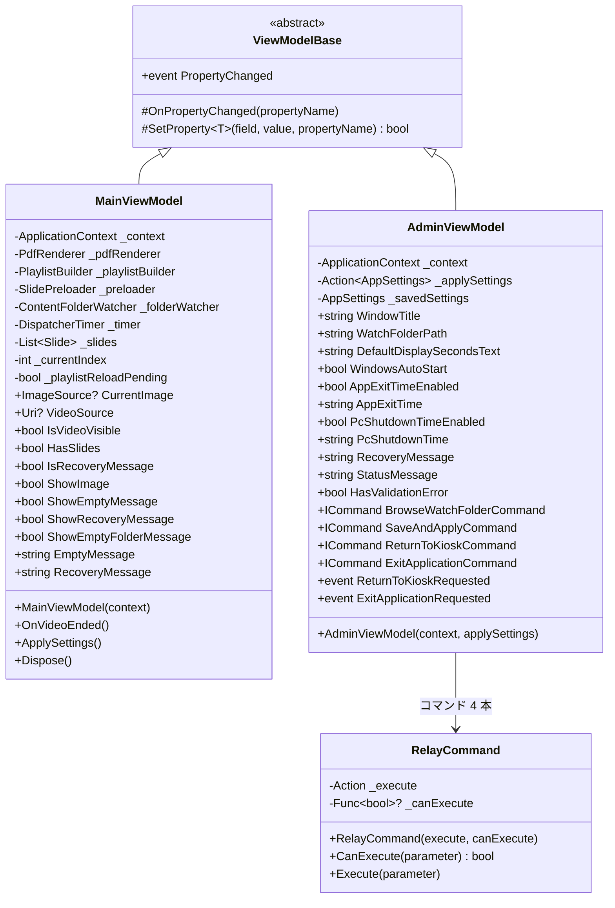
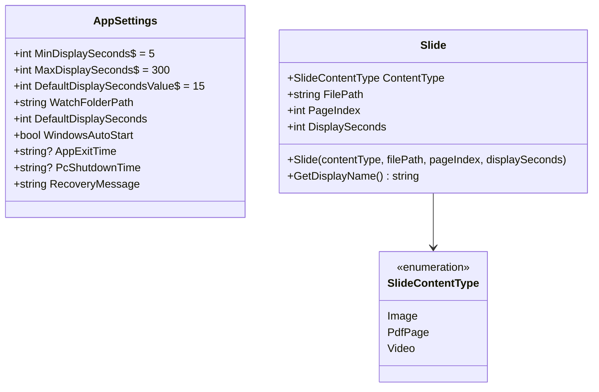
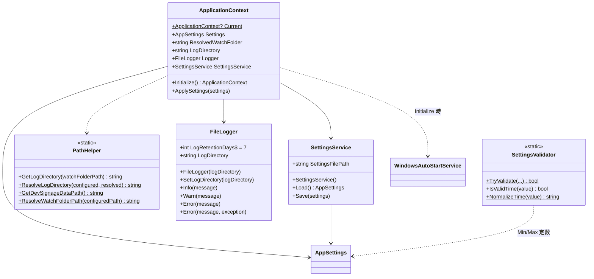
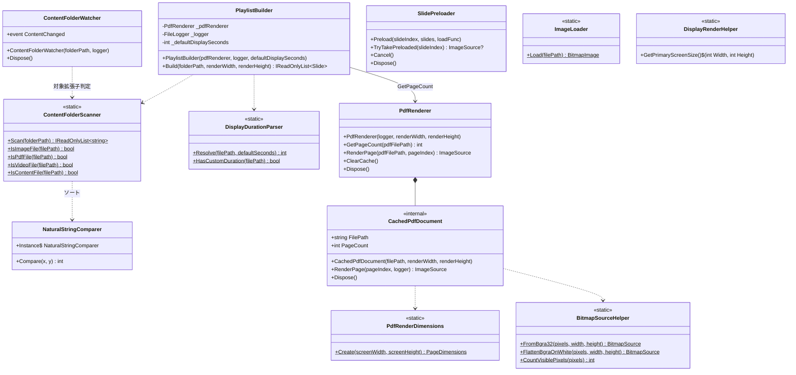
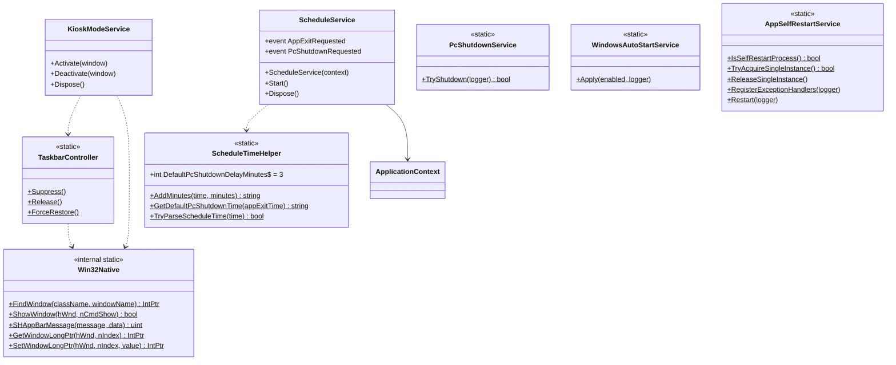

# クラス設計図（PdfSignage）

現状コード（`PdfSignage/`）から起こしたクラス構成。処理の流れ・ライフサイクルは [設計書.md](設計書.md) を参照する。

- 対象: `PdfSignage` プロジェクトの型（テストプロジェクトは対象外）
- 依存の向き: **View → ViewModel → Services**。Services は View / ViewModel を参照しない
- DI コンテナは使わない。共有は `ApplicationContext.Current`（[ADR 0002](adr/0002-di-コンテナを使わない.md)）

図は Mermaid の `classDiagram`。GitHub / VS Code プレビューで描画できる。

---

## 1. 名前空間と配置

| 名前空間 | フォルダ | 役割 |
|---------|---------|------|
| `PdfSignage` | ルート | `App`（WPF エントリ） |
| `PdfSignage.Views` | `Views/` | ウィンドウ（XAML + code-behind） |
| `PdfSignage.ViewModels` | `ViewModels/` | 画面状態・コマンド |
| `PdfSignage.Models` | `Models/` | 永続化・再生の純粋データ |
| `PdfSignage.Services` | `Services/` | 再生・設定・OS 連携 |
| `PdfSignage.Interop` | `Interop/` | Win32 P/Invoke（`internal`） |

`CachedPdfDocument` と `Win32Native` だけが `internal`。それ以外の型は `public`。

---

## 2. 全体関係（インスタンスの持ち方）

起動後に実際に繋がっているオブジェクトの関係。静的ヘルパーへの呼び出しは点線。



`MainWindow` が `AdminWindow` を持つのは管理モード中だけ。キオスクに戻ると閉じ、参照は切る。

---

## 3. 継承・インターフェース



`ViewModelBase` だけが抽象クラス。残りは具象。

`Dispose` の呼び出し元は次のとおり。

| 型 | 誰が Dispose するか |
|----|---------------------|
| `MainViewModel` | `MainWindow.OnClosed` |
| `PdfRenderer` / `SlidePreloader` / `ContentFolderWatcher` | `MainViewModel.Dispose`（Watcher は設定反映時にも作り直し） |
| `ScheduleService` / `KioskModeService` | `MainWindow.OnClosed` |
| `CachedPdfDocument` | `PdfRenderer.ClearCache` / `Dispose` |

---

## 4. 起動と画面

### App



`App.xaml` の `Startup="Application_Startup"` がエントリ。コンストラクタで `Exit` / `SessionEnding` / `ProcessExit` にタスクバー復元を張る。

### View



`MainWindow` が View 層で持っている責務（ViewModel に置いていないもの）:

- キオスク枠（`KioskModeService`）
- 日次スケジュール（`ScheduleService`）
- 管理画面の開閉と `Application.Current.Shutdown()`
- `MediaElement` の Play / Stop / MediaEnded / MediaFailed

`AdminWindow` の 2 イベントは `AdminViewModel` の同名イベントへの転送。ショートカット `Ctrl+Shift+M` は `ReturnToKioskCommand` を実行する。

---

## 5. ViewModel



画面の 3 状態は `HasSlides` × `IsRecoveryMessage` の組み合わせ。導出プロパティ（`ShowImage` など）は XAML バインディング用。

`AdminViewModel` の保存経路:

`TrySaveAndApply()` → `SettingsValidator` → `SettingsService.Save` → `ApplicationContext.ApplySettings` → `WindowsAutoStartService.Apply` → コンストラクタに渡した `_applySettings`（実体は `MainViewModel.ApplySettings`）。

---

## 6. Models



- `AppSettings` は `settings.json`（camelCase）のスキーマ。範囲定数はここが唯一の定義箇所
- `Slide` は不変（setter なし）。PDF は 1 ページ = 1 `Slide`（`PageIndex` が 0 始まり）
- 動画の `DisplaySeconds` は常に `0`（タイマー進行しない）

---

## 7. 共有基盤



`ApplicationContext` のコンストラクタは `private`。生成は `Initialize()` のみ。`Current` は起動後に必ずセットされる想定で、View 側は `ApplicationContext.Current!` で参照する。

---

## 8. 再生パイプライン

ファイル列挙 → スライド展開 → 描画 → 先読み、の流れ。



対応形式の定義箇所は `ContentFolderScanner` の 3 配列だけ（`.jpg` / `.jpeg` / `.pdf` / `.mp4`）。形式を足すならここが入口。

`PlaylistBuilder.Build` の `renderWidth` / `renderHeight` はシグネチャに残っているが、実際の寸法は `PdfRenderer` のコンストラクタで既に保持している。ページ数取得のために `PdfRenderer.GetPageCount` を呼ぶと、その時点で `CachedPdfDocument` がキャッシュに入る。

`SlidePreloader` は `MainViewModel.LoadSlideContent` をコールバックとして受け取る。先読み対象は画像と PDF ページのみ。

---

## 9. OS 連携 / Interop



イベントの購読関係:

| 発行 | 購読 |
|------|------|
| `ContentFolderWatcher.ContentChanged` | `MainViewModel.OnFolderContentChanged`（pending フラグのみ） |
| `ScheduleService.AppExitRequested` | `MainWindow.OnScheduledAppExit` → `Shutdown()` |
| `ScheduleService.PcShutdownRequested` | `MainWindow.OnScheduledPcShutdown` → `PcShutdownService.TryShutdown` |
| `AdminViewModel.ReturnToKioskRequested` | `MainWindow.ExitAdminMode` |
| `AdminViewModel.ExitApplicationRequested` | `MainWindow.ExitApplication` |

---

## 10. 生成と寿命

コード上の `new` と静的初期化の対応。テストから直接 `new` できるのはコンストラクタが公開されている型に限る。

```
App.Application_Startup
  └─ ApplicationContext.Initialize()
        ├─ new SettingsService()
        ├─ SettingsService.Load() → AppSettings
        ├─ PathHelper.Resolve* （フォルダ作成）
        ├─ new FileLogger(logDirectory)
        └─ WindowsAutoStartService.Apply
  └─ new MainWindow()
        ├─ new MainViewModel(ApplicationContext.Current)
        │     ├─ DisplayRenderHelper.GetPrimaryScreenSize()
        │     ├─ new PdfRenderer
        │     ├─ new PlaylistBuilder
        │     ├─ new SlidePreloader
        │     ├─ new ContentFolderWatcher
        │     └─ new DispatcherTimer
        ├─ Loaded
        │     ├─ new KioskModeService().Activate  ※フィールドはコンストラクタで new 済み
        │     └─ new ScheduleService(context).Start()
        └─ EnterAdminMode（Ctrl+Shift+M）
              ├─ new AdminViewModel(context, applySettings)
              └─ new AdminWindow(adminViewModel)
```

静的クラス（インスタンスを持たない）:

`PathHelper` `SettingsValidator` `ContentFolderScanner` `DisplayDurationParser` `ImageLoader` `BitmapSourceHelper` `DisplayRenderHelper` `PdfRenderDimensions` `TaskbarController` `ScheduleTimeHelper` `PcShutdownService` `WindowsAutoStartService` `AppSelfRestartService` `Win32Native`

シングルトン相当:

| 型 | 仕組み |
|----|--------|
| `ApplicationContext` | 静的 `Current`。`Initialize` で一度だけ代入 |
| `NaturalStringComparer` | 静的 `Instance` |
| `AppSelfRestartService` | 静的 Mutex / フラグ |
| `TaskbarController` | 静的参照カウント |

---

## 11. 単体テストが直接触る型

`PdfSignage.Tests` は外部 I/O や UI を持たない静的ロジックだけを対象にしている。

| テスト | 対象型 |
|--------|--------|
| `ContentFolderScannerTests` | `ContentFolderScanner` |
| `DisplayDurationParserTests` | `DisplayDurationParser` |
| `NaturalStringComparerTests` | `NaturalStringComparer` |
| `PathHelperTests` | `PathHelper` |
| `ScheduleTimeHelperTests` | `ScheduleTimeHelper` |
| `SettingsValidatorTests` | `SettingsValidator` |

`MainViewModel` / `ApplicationContext` / 各 Window に自動テストは無い。挙動確認は [受け入れテスト.md](受け入れテスト.md)。

---

## 関連ドキュメント

- [設計書.md](設計書.md) — ライフサイクル、スライド進行、設定反映
- [adr/](adr/) — 個別の設計判断
- [受け入れテスト.md](受け入れテスト.md) — 手動確認
