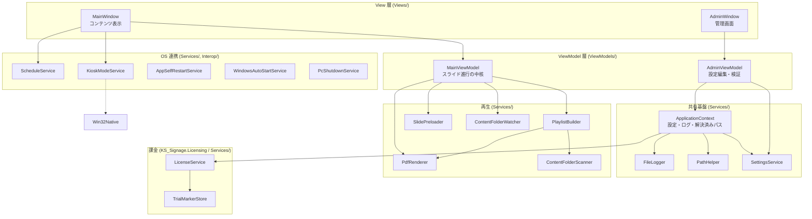
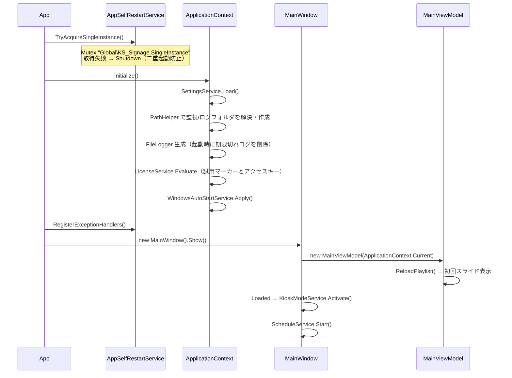
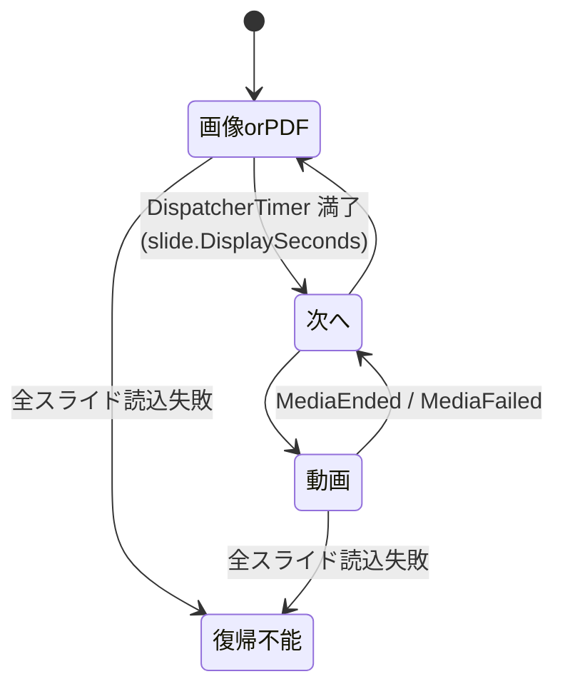
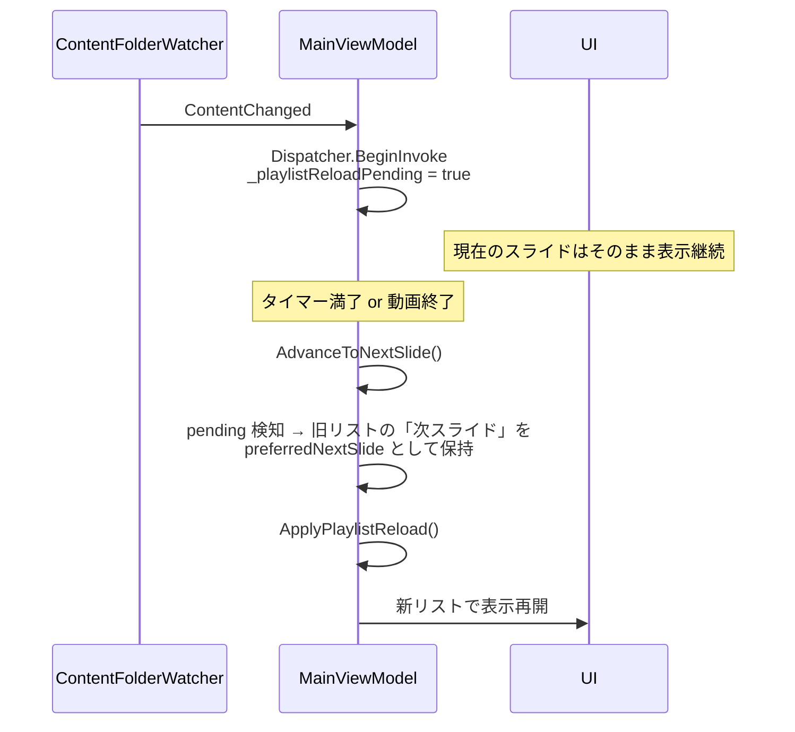

# 設計書（KS_Signage）

コードを読む前に全体像を掴むための文書。**実装の現状**を記述する（実装を変えたらここも更新する）。

- 「何を作るか」の当初要件 → [archive/アプリ要件定義書.md](archive/アプリ要件定義書.md)（凍結済み）
- 「なぜそう作ったか」 → [adr/](adr/)
- 「どう運用するか」 → [運用ガイド.md](運用ガイド.md)

---

## 1. 全体像

### 技術スタック

| 項目 | 内容 |
|------|------|
| 製品名 | 簡単！シンプル！サイネージ（exe は `KS_Signage.exe`） |
| ターゲット | `net8.0-windows` / `WinExe` / WPF |
| 実行環境 | Windows 11 x64、シングルディスプレイ |
| 外部ライブラリ | `Docnet.Core` 2.6.0（PDFium ラッパー。PDF のラスタライズ） |
| DI コンテナ | **使用しない**（`ApplicationContext` の静的インスタンスで共有 → [ADR 0002](adr/0002-di-コンテナを使わない.md)） |
| 配布形態 | ポータブル（フォルダ一式をコピー、インストーラーなし）。現場には `KS_Signage` のみ。`KS_Signage.Issuer`（発行フォーム / CLI）は同梱しない |
| 課金 | `KS_Signage.Licensing`（net8.0）。公開鍵埋め込みの ECDSA P-256。試用開始日は HKLM / ProgramData + HKCU / LocalAppData（[ADR 0013](adr/0013-試用開始日はPC側に残す.md)、[ADR 0015](adr/0015-試用開始日の片方はマシン権限に置く.md)） |

`KS_Signage.csproj` の `SelfContained` は `false` だが、これは `dotnet run` での開発を軽くするための既定値。配布ビルドの `scripts/publish.ps1` が `--self-contained true` で上書きするため、**現場に配る成果物は .NET ランタイム同梱**になる。

### レイヤー構成



**依存の向きは一方向**（View → ViewModel → Services）。Services は View / ViewModel を参照しない。この方向を崩さないこと。ViewModel から UI へは `INotifyPropertyChanged`（`ViewModelBase`）とバインディング、逆方向はコンストラクタ引数かイベントで伝える。

---

## 2. ライフサイクル

### 起動

`App.xaml` の `Startup="Application_Startup"` から始まる（`App.xaml.cs`）。



`ApplicationContext.Current` は静的プロパティ。`MainWindow` / `MainViewModel` / `AdminViewModel` はこれを直接参照する。テスト容易性より起動の単純さを優先した結果なので、単体テストしたいロジックは `ApplicationContext` に依存しない静的クラス（`DisplayDurationParser` など）に切り出す方針。

### 終了経路

終了には4つの入口があり、すべて `Application.Current.Shutdown()` に集約される。

| 経路 | 実装 |
|------|------|
| 管理画面「アプリを終了」 | `AdminViewModel.ExitApplicationRequested` → `MainWindow.ExitApplication()` |
| 管理画面を × で閉じる | `MainWindow.OnAdminWindowClosed()`。**コンテンツ表示モードに戻るのではなく終了する** |
| スケジュール（アプリ終了時刻） | `ScheduleService.AppExitRequested` → `MainWindow.OnScheduledAppExit()` |
| 未処理例外 | `AppSelfRestartService` が別プロセスを起動してから `Shutdown()` |

終了時は `App.OnApplicationExit` で `TaskbarController.ForceRestore()`（タスクバーを必ず戻す）と Mutex 解放を行う。`SessionEnding` と `ProcessExit` にも `ForceRestore` を張ってあるのは、**異常終了でタスクバーが隠れたまま残るのを防ぐため**。ここを外すと現場の PC が操作不能に見える状態になる。

### 管理モードの確認ダイアログ

`MainWindow.EnterAdminMode()` のたびに、実行中の監視フォルダを再スキャンする。コンテンツ表示中には出さない。既読管理はせず、入場のたびに出し直す。

| 対象 | 生成 | タイトル | 本文 |
|------|------|----------|------|
| ファイル名の秒数・期限の誤り | `DisplayDurationParser.FormatIssuesMessage` | 表示期限の指定 | 修正案内（例: `○○_20261231`、`○○_20_20260212`）と対象ファイル名 |
| 開けないコンテンツ | `ContentFileProbe.FormatBrokenFilesMessage` | 壊れたファイル | 差し替え案内と対象ファイル名 |

両方あるときはファイル名誤りを先に出す。個別の技術理由は MessageBox には出さず、ログの WARN / ERROR に残す。コピー途中の排他ロックは破損扱いしない。動画は `ftyp` ヘッダまで（[ADR 0009](adr/0009-ファイル名の再生期限と入力誤りはキオスクを止めない.md)、[ADR 0010](adr/0010-6-7桁の末尾数字は日付の桁落ちとして扱う.md)、[ADR 0011](adr/0011-壊れたファイルも管理モード入場時に知らせる.md)）。

---

## 3. スライドショーの中核

`MainViewModel` がすべてを持っている。設計上いちばん複雑なのはここ。

### プレイリストの構築

```
ContentFolderScanner.Scan(フォルダ)
    直下のみ列挙 → .jpg/.jpeg/.pdf/.mp4 で絞る → NaturalStringComparer で自然順ソート
        ↓
PlaylistBuilder.Build()
    画像 → Slide(Image)   1 ファイル = 1 スライド
    PDF  → Slide(PdfPage) ページ数だけ展開（全ページ同じ表示秒数）
    動画 → Slide(Video)   DisplaySeconds = 0
```

ファイル名末尾のメタデータは `DisplayDurationParser` が解決する。拡張子を除いた名前の末尾から `_数字` を最大 2 個だけ集め、途中の `_001` などは無視する。

| トークン | 意味 |
|---------|------|
| 1〜3 桁かつ 5〜300 | 表示秒数。動画は解析しても `Slide.DisplaySeconds = 0` のまま（[ADR 0004](adr/0004-動画の表示時間指定を無効にする.md)） |
| 6〜7 桁 | 8 桁日付の桁落ちとして入力誤り。期限なし（[ADR 0010](adr/0010-6-7桁の末尾数字は日付の桁落ちとして扱う.md)） |
| 8 桁かつ `yyyyMMdd` として実在する日 | 再生期限（`DateOnly`）。**当日まで再生**し、`today > expiresOn` なら対象外 |

順序は問わない（`案内_20_20260212.pdf` と `案内_20260102_30.pdf` はどちらも有効）。`Resolve(path, defaultSeconds)` は秒数だけを返す互換 API。`FormatIssuesMessage` は MessageBox 用に案内文＋ファイル名を返す。

入力誤りは再生を止めない。誤った指定だけ捨て、残りを使う（[ADR 0009](adr/0009-ファイル名の再生期限と入力誤りはキオスクを止めない.md)）。

- 存在しない日付（`_20261301`）→ 期限なし
- 秒数の範囲外（`_4`, `_301`）→ デフォルト秒数
- 秒数の重複（`_20_30`）→ デフォルト秒数
- 日付の重複（`_20260101_20260202`）→ 期限なし
- 6〜7 桁（`_2026923`）→ 8 桁日付の桁落ちとして誤り。期限なし（[ADR 0010](adr/0010-6-7桁の末尾数字は日付の桁落ちとして扱う.md)）
- 4〜5 桁・9 桁以上（`IMG_2716.jpg`、`案内_2024.pdf`）→ メタデータではないので打ち切り。誤りにもしない

`PlaylistBuilder.Build()` は期限切れファイルをスライド化せず INFO ログを残す。誤りがあってもスライドは作る。`Slide` に期限フィールドは持たない（判定は構築時だけ）。

PDF のページ数取得に失敗したファイルは、**プレイリスト構築の時点でスキップ**される（ログに ERROR）。つまり壊れた PDF は最初からスライドに入らない。管理モード入場時は `ContentFileProbe` が同じファイルを開けないものとして MessageBox に載せる。

### 表示状態

`HasSlides` と `IsRecoveryMessage` の組み合わせで、画面は3状態を取る。ここは混同しやすい。

| 状態 | 条件 | 画面 |
|------|------|------|
| 通常表示 | `HasSlides = true` | 画像 or 動画（`IsVideoVisible` で切替） |
| 空フォルダ | `HasSlides = false` かつ `IsRecoveryMessage = false` | 「表示するコンテンツがありません」＋フォルダパス（小さいグレー文字） |
| 復帰不能 | `HasSlides = false` かつ `IsRecoveryMessage = true` | 設定した `RecoveryMessage`（大きい文字） |

**空フォルダと復帰不能は別物**。ファイルが1つも無いのは正常な状態として扱い、ファイルはあるのに全部読めない場合だけを異常として扱う。

復帰不能に落ちるのは次の2つだけ。

1. 対象ファイルは存在するのに、プレイリストが 0 件になった（PDF が全部壊れている等）
2. `ShowCurrentSlideOrSkip()` でスライド数と同じ回数リトライしても、どれも表示できなかった

空フォルダ状態のときはタイマーがデフォルト表示秒数間隔で回り続け、`OnTimerTick` から `ReloadPlaylist()` を呼ぶ**ポーリング**になる。`FileSystemWatcher` だけに頼らず、これで確実に復帰する。

### スライドの進行



- 画像・PDF ページ: `DispatcherTimer.Interval = slide.DisplaySeconds` で進む
- 動画: **タイマーを止める**。`MediaEnded` で `MainViewModel.OnVideoEnded()` が呼ばれて進む。`MediaFailed` でも同じ経路を通るので、再生できない動画でループが止まることはない
- ループ: `_currentIndex = (_currentIndex + 1) % _slides.Count`
- 読込失敗: その場で次のスライドへスキップし、`attempts` がスライド数に達したら復帰不能へ

### フォルダ変更の遅延反映

要件の肝。**表示中のスライドを中断しない**ために、検知と反映を分離している（[ADR 0003](adr/0003-フォルダ変更をスライド境界まで遅延させる.md)）。



再構築後の再生位置は `ResolveIndexAfterReload()` が決める。順に、

1. `preferredNextSlide` と同じ `(FilePath, PageIndex)` が新リストにあればそこ
2. 無ければ、旧リストの並びで `preferredNextSlide` 以降を順に探し、新リストに残っている最初のスライド
3. それも無ければ旧リストの先頭側を探す
4. 全部だめなら index 0

「表示中のファイルが削除されても、次に来るはずだったファイルの近くから再開する」ための処理。ここを単純な index 0 に変えると、コンテンツを1つ差し替えるたびに先頭へ巻き戻る挙動になる。

`ApplyPlaylistReload()` は副作用として `SlidePreloader.Cancel()` と `PdfRenderer.ClearCache()` を呼ぶ。**差し替えられた PDF の古いページが表示され続けるのを防ぐため**にキャッシュを捨てている。

日付が変わると期限切れが発生する。`ScheduleService` の 30 秒ティックで日付跨ぎを検知し、フォルダ変更と同じ `_playlistReloadPending` を立てて**次スライド境界**で再構築する。同じ跨ぎで課金状態も再計算し、期限切れ帯を出し入れする。表示中のスライドは中断しない。

### 先読み

`SlidePreloader` が次スライドの `ImageSource` をバックグラウンドスレッドで生成しておく。対象は画像と PDF ページのみ（動画は除外）。`ShowImageSlide()` は先読み済みがあればそれを使い、無ければその場で読む。切替時間 3 秒以内という性能目標のための仕組み。

切替に 3000 ms を超えると `FileLogger.Warn` に「スライド切替が遅延」が出る。性能劣化はログで検知できる。

---

## 4. 設定

### スキーマ

`Models/AppSettings.cs`。`settings.json` は **camelCase** で保存される（`JsonNamingPolicy.CamelCase`）。

| プロパティ | 型 | 既定値 | 備考 |
|-----------|-----|--------|------|
| `WatchFolderPath` | `string` | `D:\Signage` | |
| `AllowNetworkWatchFolder` | `bool` | `false` | 管理画面からは変更しない。true で UNC / ネットワークドライブを許可（[ADR 0012](adr/0012-スタンドアロン商品は監視フォルダをこのPC内に限定する.md)） |
| `DefaultDisplaySeconds` | `int` | `15` | 読み書き時に 5〜300 へクランプ |
| `WindowsAutoStart` | `bool` | `false` | |
| `AppExitTime` | `string?` | `null` | `HH:mm`。null = 無効 |
| `PcShutdownTime` | `string?` | `null` | `HH:mm`。null = 無効 |
| `RecoveryMessage` | `string` | `表示を復旧しています` | 空文字なら既定値へ戻す |
| `AccessKey` | `string` | `""` | 署名付きアクセスキー。空なら試用判定。JSON は `accessKey` |

範囲の定数は `AppSettings.MinDisplaySeconds` / `MaxDisplaySeconds` / `DefaultDisplaySecondsValue`。**5〜300 を変えるならここ1箇所**で、`DisplayDurationParser` と `SettingsValidator` は定数を参照している。

### 配置とパス解決

`settings.json` は `AppContext.BaseDirectory`（exe と同じフォルダ）に置く。ポータブル配布のための選択（[ADR 0005](adr/0005-設定ファイルを-exe-と同じ場所に置く.md)）。読み込みに失敗した場合は既定値で起動し、`settings_load_error.log` を exe 横に追記する（ログフォルダがまだ確定していないため）。アクセスキーもここに入る。**現場の exe を差し替えるときは `settings.json` を残す。** 残していればキーの再入力は不要。フォルダごと消すとキーも消える。試用開始日は exe 横には置かない（[ADR 0013](adr/0013-試用開始日はPC側に残す.md)）。

`PathHelper` のフォールバックが少し込み入っている。

```
ResolveWatchFolderPath(設定パス, allowNetworkWatchFolder)
  ネットワーク未許可で UNC / 割り当てドライブ → {exe}/SignageData を作成して使用
  設定パスのフォルダが存在する           → そのフルパス
  ドライブは存在するがフォルダが無い     → フォルダを作成して使用
  ドライブごと存在しない（開発 PC 等）   → {exe}/SignageData を作成して使用
```

ログフォルダは **この PC の `%LocalAppData%\KS_Signage\logs`** に固定する（[ADR 0014](adr/0014-ログをこのPCのLocalAppDataに置く.md)）。監視フォルダ（共有・USB を含む）には連動しない。`settings.json` の読み込み失敗だけは exe 横の `settings_load_error.log`。

### 反映の流れ

```
AdminViewModel.TrySaveAndApply()
  → SettingsValidator.TryValidate()      入力検証（NG なら赤メッセージで中断）
  → SettingsService.Save()               settings.json へ書き込み
  → ApplicationContext.ApplySettings()   解決済み監視フォルダを差し替え（ログ先は PC 側で固定）
  → WindowsAutoStartService.Apply()      レジストリ Run キーを更新
  → コールバック → MainViewModel.ApplySettings()
        PlaylistBuilder と ContentFolderWatcher を作り直し
        ApplyPlaylistReload(startIndex: 0)  ← 先頭から再生し直す
        RefreshLicenseBanner()
```

`ApplicationContext.ApplySettings` はパス差し替えのあと `RefreshLicense()` も呼ぶ。

アクセスキーは別経路。「アクセスキーを適用」で即検証・`settings.json` 保存・状態再計算。他設定の「保存して設定する」でもキーが変わっていれば検証する。不正なら**他設定は保存し、キーは旧値を維持**する。

保存すると**再生位置は先頭に戻る**。監視フォルダ自体が変わりうるため位置の維持に意味がないという判断だが、フォルダを変えずに秒数だけ変えた場合も巻き戻る。

`ScheduleService` は `_context.Settings` を tick ごとに読み直すので、時刻設定はサービスを作り直さなくても反映される。

---

## 5. OS 連携

| サービス | 役割 | 注意点 |
|---------|------|--------|
| `KioskModeService` | 枠なし全画面・Topmost・タスクバー抑制・`WS_EX_TOOLWINDOW` 付与 | Alt+Tab の完全抑制は OS 制約で不可（[ADR 0006](adr/0006-alt-tab-の完全抑制を諦める.md)） |
| `TaskbarController` | タスクバーの表示/非表示を**参照カウント**で管理 | `ForceRestore()` は異常終了時の保険。減らさないこと |
| `ScheduleService` | 30 秒間隔で時刻を監視 | 「跨いだ瞬間」でのみ発火。日付跨ぎでは `DateRolledOver` も発火 |
| `PcShutdownService` | `shutdown /s /t <秒> /f` を実行 | ポリシーで失敗しうる。失敗はログのみ。アプリ終了が先のときは終了時に遅延シャットダウンを予約する |
| `WindowsAutoStartService` | `HKCU\...\Run` の `KS_Signage` 値を追加/削除 | 標準ユーザー権限で可 |
| `AppSelfRestartService` | Mutex による二重起動防止と、未処理例外時の自己再起動 | 30 秒クールダウン（[ADR 0007](adr/0007-自己再起動にクールダウンを設ける.md)） |
| `FileLogger` | `app_yyyyMMdd.log` に追記、7 日で自動削除 | `lock` で直列化。高頻度呼び出しには向かない |

### スケジュール判定の落とし穴

`ScheduleService.CrossedScheduleTime()` は「前回チェック時刻 < 設定時刻 ≦ 今回チェック時刻」でのみ true を返す。`Start()` は前回チェック時刻を**起動時刻そのもの**で初期化する。

その結果、**アプリ起動時点で既に設定時刻を過ぎている日は、その日は発火しない**。18:00 終了設定の PC を 20:00 に手動起動しても即座に終了しない、という仕様。意図的な設計だが、「終了時刻を過ぎたら即終了してほしい」と誤解されやすいので、変更する場合は運用ガイドの記述も合わせること。

もう一つの落とし穴は、アプリ終了時刻が PC 電源オフより先に来る設定（既定は 3 分後）である。スケジューラはプロセス内で動くため、先に `Application.Shutdown()` すると電源オフ時刻を監視できない。`OnScheduledAppExit` は終了前に `shutdown /s /t <秒> /f` で OS へ予約する。

日付跨ぎ（23:59 → 00:01）は `previous > current` の分岐で処理している。同じ跨ぎで `DateRolledOver` を発火し、`MainWindow.OnDateRolledOver` が `RefreshLicense`（課金状態と帯）とプレイリスト再構築予約（再生期限）を行う。表示中のスライドは中断しない。

### 課金（試用・アクセスキー）

方針の正は [課金方針.md](課金方針.md)。期限切れでも映像は止めない。

| 状態 | 判定 | コンテンツ表示 |
|------|------|----------|
| 試用中 | 有効なキーなし。初回起動日から暦日 60 日以内（当日含む） | 通常表示 |
| 試用切れ | 有効なキーなし。61 日目以降 | 下端の更新案内 |
| 契約中 | 署名が正しく、キーの `exp` が当日以降 | 通常表示 |
| 契約切れ | 署名は正しいが `exp` を過ぎた | 下端の更新案内 |

キー形式は `PDS1.{payloadB64url}.{sigB64url}`。ペイロードは `v` `n` `org` `exp`（yyyy-MM-dd）`plan`（`standard` / `site`）。検証は埋め込み公開鍵のみ（`AccessKeyPublicKey`）。秘密鍵は `secrets/`（git 対象外）。発行は `KS_Signage.Issuer` のフォーム（引数なし）または CLI。履歴は `secrets/issued-access-keys.json`。手順は [アクセスキー発行.md](アクセスキー発行.md)（販売側。操作ガイド・運用ガイドには書かない）。

試用開始日は exe 横に置かない。`TrialMarkerStore` がマシン領域（`HKLM\Software\KS_Signage\TrialStart` と `%ProgramData%\KS_Signage\trial.dat`）とユーザー領域（`HKCU\Software\KS_Signage\TrialStart` と `%LocalAppData%\KS_Signage\trial.dat`）へ XOR 難読化して書き、欠け側へ書き戻す。HKLM への書き込みは管理者昇格時だけ（失敗しても起動は続ける）。すべて無い／壊れているとその日が新しい初日になる。

帯の文言は `LicenseService.RenewalBannerMessage`（試用切れも同じ文面。方針どおり）。失敗してもコンテンツ表示は出す。

---

## 6. クラス一覧

型ごとのメンバー・継承・生成関係の図は [クラス設計図.md](クラス設計図.md)。以下は責務の索引。

### Models

| クラス | 責務 |
|--------|------|
| `AppSettings` | 設定モデル。表示秒数の範囲定数を持つ |
| `Slide` | 表示単位（画像1枚 / PDF 1ページ / 動画1本）。`ContentType` `FilePath` `PageIndex` `DisplaySeconds` |
| `SlideContentType` | `Image` / `PdfPage` / `Video` |

### ViewModels

| クラス | 責務 |
|--------|------|
| `ViewModelBase` | `INotifyPropertyChanged` と `SetProperty<T>()` |
| `RelayCommand` | パラメータなしの `ICommand` |
| `MainViewModel` | スライド進行、プレイリスト再構築、表示状態、期限切れ帯 |
| `AdminViewModel` | 設定の編集・検証・保存、アクセスキー適用、ライセンス表示（状態・期限・契約番号・組織名）。タイトルバーに製品名とバージョン |
| `LicenseAdminDisplay` | 管理画面ライセンス欄の文言（状態・期限・契約番号・組織名） |

### KS_Signage.Issuer（販売側。現場配布には含めない）

| クラス | 責務 |
|--------|------|
| `IssuerWindow` / `IssuerViewModel` | 発行フォーム。通し番号・プラン・期限・組織名の入力と、作成済みキーの一覧・コピー |
| `IssuedAccessKeyStore` | `secrets/issued-access-keys.json` の読み書き |
| `SerialNumberSuggester` | 台帳から次の `C-0001` 形式を決める |
| `IssuerPaths` | リポジトリの `secrets/` を探す |
| `Program` | 引数なしでフォーム。`issue` / `gen-keys` は CLI |

### Services — 共有基盤

| クラス | 責務 |
|--------|------|
| `ApplicationContext` | 設定・ログ・解決済みパス・課金状態の共有コンテナ（静的 `Current`）。`RefreshLicense()` |
| `SettingsService` | `settings.json` の読み書きと正規化 |
| `LicenseService` | 試用マーカーとアクセスキーから状態を決める。公開鍵検証の入口 |
| `TrialMarkerStore` | HKLM / ProgramData と HKCU / LocalAppData への試用開始日の読み書き（[ADR 0013](adr/0013-試用開始日はPC側に残す.md)、[ADR 0015](adr/0015-試用開始日の片方はマシン権限に置く.md)） |
| `PathHelper` | 監視フォルダのパス解決とフォールバック。ログ先は `GetLogDirectory()`（LocalAppData） |
| `WatchFolderLocationPolicy` | UNC / ネットワークドライブ判定（[ADR 0012](adr/0012-スタンドアロン商品は監視フォルダをこのPC内に限定する.md)） |
| `FileLogger` | 日次ログ出力と保存期間管理 |
| `SettingsValidator` | 管理画面入力の検証 |

### Services — 再生

| クラス | 責務 |
|--------|------|
| `ContentFolderScanner` | 直下の対象ファイル列挙と拡張子判定。**対応形式の唯一の定義箇所** |
| `ContentFolderWatcher` | `FileSystemWatcher` のラッパー。対象拡張子の変更だけを通知 |
| `NaturalStringComparer` | 自然順ソート |
| `PlaylistBuilder` | ファイル一覧 → `Slide` 列への変換 |
| `DisplayDurationParser` | ファイル名末尾 `_秒数` / `_YYYYMMDD` の解決と誤り収集。`FormatIssuesMessage` で管理モード用案内文を生成 |
| `ContentFileProbe` | 画像・PDF・動画が開けるかの判定。`FormatBrokenFilesMessage` で管理モード用案内文を生成 |
| `FilenameSuffixParseResult` | 秒数・期限・誤りの解析結果 |
| `SlidePreloader` | 次スライドのバックグラウンド先読み |
| `PdfRenderer` | PDF のオープンとページ描画、ドキュメントキャッシュ |
| `CachedPdfDocument` | 1 PDF 分の `IDocReader` 保持（internal） |
| `PdfRenderDimensions` | Docnet 用のレンダリング寸法計算 |
| `ImageLoader` | JPEG → `BitmapImage` |
| `BitmapSourceHelper` | BGRA → `BitmapSource` 変換、白背景合成 |
| `DisplayRenderHelper` | プライマリ画面の解像度取得（失敗時 1920×1080） |

### Services — OS 連携 / Interop

| クラス | 責務 |
|--------|------|
| `KioskModeService` `TaskbarController` `Win32Native` | コンテンツ表示とタスクバー制御 |
| `ScheduleService` `ScheduleTimeHelper` `PcShutdownService` | 日次スケジュール |
| `WindowsAutoStartService` | Windows 自動起動 |
| `AppSelfRestartService` | 単一インスタンスと自己再起動 |

---

## 7. 変更ガイド

よくある変更の入口と、**一緒に直す必要がある場所**。

### 対応ファイル形式を追加する（例: PNG）

1. `ContentFolderScanner.ImageExtensions` に追加
2. `ImageLoader.Load()` が対応できるか確認（`BitmapImage` なので PNG は通る見込み）
3. `PlaylistBuilder` は `IsImageFile()` 判定なので変更不要
4. ドキュメント: [操作ガイド.md](操作ガイド.md) 2.3 / [運用ガイド.md](運用ガイド.md) / [受け入れテスト.md](受け入れテスト.md)
5. `docs/操作ガイド.pptx` を `scripts/build-operation-guide-pptx.ps1` で再生成

### 表示秒数の範囲を変える

`AppSettings.MinDisplaySeconds` / `MaxDisplaySeconds` の 2 定数のみ。`DisplayDurationParser` と `SettingsValidator` は参照しているので追随する。ドキュメント側は 3 ファイルに数値が出てくる。

### ファイル名サフィックスのルールを変える

入口は `DisplayDurationParser`。一緒に直す場所は `PlaylistBuilder`（期限切れ除外）、`ScheduleService` / `MainWindow.OnDateRolledOver`（日付跨ぎの再構築予約）、`MainWindow.EnterAdminMode`（管理モードの MessageBox）。ドキュメントは操作ガイド・運用ガイド・受け入れテスト・クラス設計図。桁数ルールの変更は [ADR 0010](adr/0010-6-7桁の末尾数字は日付の桁落ちとして扱う.md) を参照。

### 壊れたファイルの判定を変える

入口は `ContentFileProbe`。一緒に直す場所は `MainWindow.EnterAdminMode`（管理モードの MessageBox）。動画を最後まで再生できるかまで見るなら [ADR 0011](adr/0011-壊れたファイルも管理モード入場時に知らせる.md) の「コンテナヘッダまで」を見直す。ドキュメントは操作ガイド・運用ガイド・受け入れテスト・クラス設計図。

### 管理画面に設定項目を追加する

`AppSettings` にプロパティ → `AdminViewModel` にプロパティとバインディング → `AdminWindow.xaml` の該当タブ（再生設定 = 表示と運転、ライセンス等 = ライセンスとログ）に UI → 必要なら `SettingsValidator` に検証 → `MainViewModel.ApplySettings()` か対応サービスへ反映。`settings.example.json` も更新する。保存ボタンはタブの外。

### 課金の判定や帯を変える

入口は `LicenseStateEvaluator` と `LicenseService`。試用残存は `TrialMarkerStore` / `TrialMarkerResolver`。帯の出し入れは `MainViewModel.RefreshLicenseBanner`。キー形式は `AccessKeyCodec`。公開鍵を差し替えると既存キーはすべて無効になる。発行画面は `KS_Signage.Issuer` の `IssuerViewModel`。ドキュメントは操作ガイド・運用ガイド・受け入れテスト・課金方針・[アクセスキー発行.md](アクセスキー発行.md)・[ADR 0013](adr/0013-試用開始日はPC側に残す.md)・[ADR 0015](adr/0015-試用開始日の片方はマシン権限に置く.md)・[ADR 0016](adr/0016-アプリ識別子を-KS_Signage-にする.md)。

### スライド進行のルールを変える

`MainViewModel` の `AdvanceToNextSlide()` / `RestartTimerForCurrentSlide()` / `ShowCurrentSlideOrSkip()` の 3 メソッドが中心。動画だけはタイマーではなく `MediaEnded` 起点であることに注意。

### ログの内容を変える

`FileLogger` は追記のみ。受け入れテストが `スライド切替: ... (Nms)` という文字列に依存している（性能確認手順）。**このメッセージ形式を変えるなら受け入れテストも直す。**

### ログの出力先を変える

入口は `PathHelper.GetLogDirectory()`。[ADR 0014](adr/0014-ログをこのPCのLocalAppDataに置く.md)。ドキュメントは操作ガイド（+ pptx）・運用ガイド・受け入れテスト・課金方針。

---

## 8. 既知の弱点

保守時に踏みやすい箇所を、言い訳せずに列挙する。

| 箇所 | 内容 |
|------|------|
| `MainViewModel` | 400 行超。プレイリスト管理・表示状態・タイマー・先読みを1クラスで持っている。機能追加が続くなら分割が必要 |
| `ApplicationContext.Current` | 静的シングルトン。ViewModel の単体テストが実質できない |
| 自動テスト | UI・フォルダ監視・`TrialMarkerStore` の実 I/O は無い。退行の手動確認は [受け入れテスト.md](受け入れテスト.md)。純粋ロジック（`DisplayDurationParser`（秒数・期限） `ContentFileProbe` `NaturalStringComparer` `ScheduleTimeHelper` `SettingsValidator` `PathHelper` `WatchFolderLocationPolicy` アクセスキー／課金状態 `LicenseAdminDisplay` 発行台帳 `IssuedAccessKeyStore` `SerialNumberSuggester` `IssuerViewModel`）は `KS_Signage.Tests` でカバー済み |
| 期限切れ帯の文言 | 試用切れも「契約期限が切れています」。方針の文面どおりだが、未契約には紛らわしい |
| `FileLogger` | 全書き込みが `lock` + `File.AppendAllText`。ループ 1 周ごとに数行程度なので実害はないが、ログを増やすなら要検討 |
| マルチモニタ | プライマリ固定。`DisplayRenderHelper` と `KioskModeService` の両方が `PrimaryScreen*` を見ている |
| 動画の音声 | 明示的な制御なし（既定で音が出る）。要件に記載がなかったため未実装 |

---

## 関連ドキュメント

- [クラス設計図.md](クラス設計図.md) — クラス構成（再生期限の決定仕様を含む）
- [運用ガイド.md](運用ガイド.md) — 現場での運用・ログ・権限・制限事項
- [操作ガイド.md](操作ガイド.md) — 利用者向けの日常操作
- [受け入れテスト.md](受け入れテスト.md) — リリース前の手動確認
- [課金方針.md](課金方針.md) — 売り方・ライセンス（アプリ実装済み。売る前の台帳・決済・規約は対象外）
- [アクセスキー発行.md](アクセスキー発行.md) — 販売側の発行フォーム / CLI（操作ガイド・運用ガイドには書かない）
- [競合比較.md](競合比較.md) — 簡易ソフト・PowerPoint 等との位置づけ
- [adr/](adr/) — 設計判断の記録
- [archive/アプリ要件定義書.md](archive/アプリ要件定義書.md) — MVP 時点の要件（凍結）
